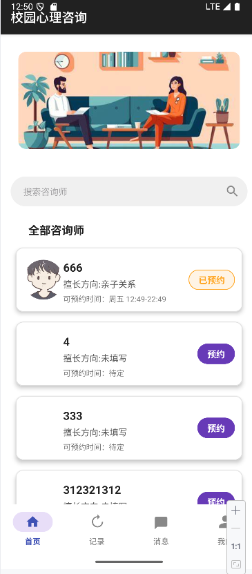
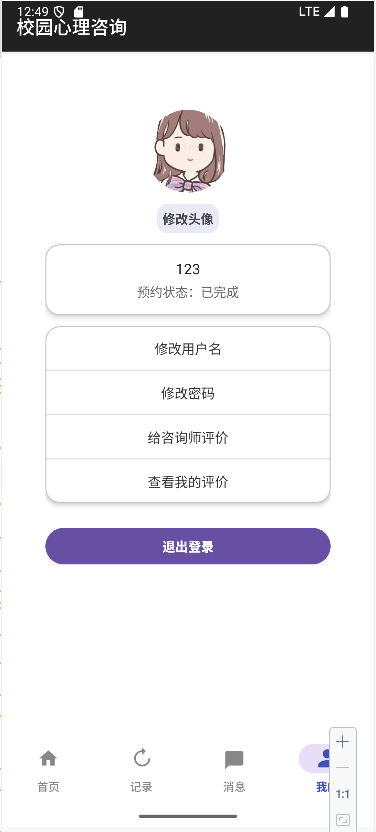
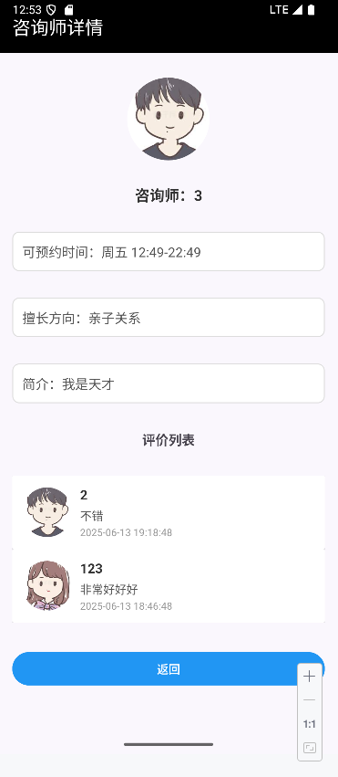
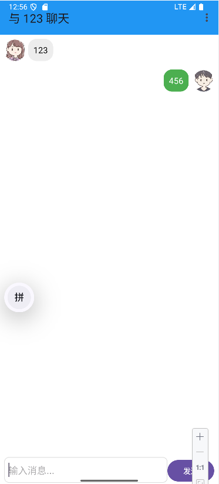

# 心理健康咨询App(Android安卓大作业/Android安卓课设)

!

## 软件概述

这是学校“软件开发实践”中给我分配的Android作业，这里我就得吐槽一句了，为什么老是学期末突然有一些课......

这个项目我觉得用来应付作业完全没问题。

附带报告，如果该项目解决了你期末作业的问题，不妨给我一个⭐吧！

## 题目要求

设计并实现一个基于Android平台的校园心理咨询预约平台App，该平台旨在为学生和教职工提供一个便捷的心理咨询服务预约和管理工具，以促进心理健康意识的普及和心理健康资源的有效利用。

用户可以通过App预约心理咨询服务，查看心理咨询师的简介和可预约时间，管理自己的预约记录，并在咨询后提供反馈。功能模块包括心理咨询师管理、预约管理、个人预约记录和反馈系统等。心理咨询师管理：展示心理咨询师的资质、擅长领域和可预约时间。预约管理：用户可以选择合适的心理咨询师和时间进行预约。个人预约记录：用户可以查看和管理自己的预约历史。反馈系统：用户在咨询结束后可以对咨询师的服务进行评价和反馈。

## 软件截图（部分）

!)

## 存在的BUG（我发现的）：

- 咨询师、用户的状态更新逻辑
- 修改用户名后，与该用户所关的某些信息会显示异常
- 聊天界面中软键盘与输入框显示异常
- More......

##  SQLite数据库介绍

### users表

存储用户的基本信息，包括用户名、密码、角色类型（普通用户或咨询师）、头像、擅长领域、可预约时间和简介。

| 列名           | 数据类型 | 描述                             |
| -------------- | -------- | -------------------------------- |
| id             | INTEGER  | 主键，自增                       |
| username       | TEXT     | 用户名，唯一                     |
| password       | TEXT     | 用户密码                         |
| role           | INTEGER  | 用户角色（0=普通用户，1=咨询师） |
| avatar         | BLOB     | 用户头像（以二进制存储）         |
| expertise      | TEXT     | 咨询师的擅长领域                 |
| available_time | TEXT     | 咨询师的可预约时间               |
| introduction   | TEXT     | 咨询师的简介                     |

###  appointments表

存储用户与咨询师的预约记录，包括预约状态、时间戳等。

| 列名             | 数据类型 | 描述                                   |
| ---------------- | -------- | -------------------------------------- |
| id               | INTEGER  | 主键，自增                             |
| user_name        | TEXT     | 用户名（外键，指向 users 表）          |
| counselor_name   | TEXT     | 咨询师用户名（外键，指向 users 表）    |
| status           | TEXT     | 预约状态（已预约、心理治疗中、已完成） |
| timestamp        | DATETIME | 预约时间戳                             |
| counselor_avatar | BLOB     | 咨询师头像（以二进制存储）             |
| user_avatar      | BLOB     | 用户头像（以二进制存储）               |

### feedbacks表

存储用户对咨询师的评价，包括评价内容、时间戳等信息。

| 列名           | 数据类型 | 描述                                |
| -------------- | -------- | ----------------------------------- |
| id             | INTEGER  | 主键，自增                          |
| user_name      | TEXT     | 用户名（外键，指向 users 表）       |
| counselor_name | TEXT     | 咨询师用户名（外键，指向 users 表） |
| content        | TEXT     | 评价内容                            |
| timestamp      | DATETIME | 评价时间戳                          |

### messages表

存储用户与咨询师之间的聊天记录，包括消息内容、发送者、接收者和时间戳。

| 列名      | 数据类型 | 描述             |
| --------- | -------- | ---------------- |
| id        | INTEGER  | 主键，自增       |
| sender    | TEXT     | 发送者（用户名） |
| receiver  | TEXT     | 接收者（用户名） |
| content   | TEXT     | 消息内容         |
| timestamp | DATETIME | 消息时间戳       |